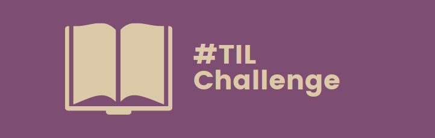

<!-- PROJECT LOGO -->
 

  

<h3 align="center">#TILChallenge</h3>

  

    Track your daily learnings and form a new habit.
     
  

<!-- ABOUT THE PROJECT -->
## About The Project

### What for?
> Psychology research and learning experts suggest writing things down leads to better learning. Writing helps us monitor what we know, as well as causing us to engage in retrieval practice: a more active form of learning.

Writing down your everyday learnings is a great way to track your experiences and findings during your daily work. 

### Is this only for coders?

> Keeping up to date with programming technologies has never been more necessary. If you truly want to stay relevant as a programmer, you have to keep learning.

As a coder, it is most likely you are continuously researching and learning new things. However, the #TILChallenge can be applied to every conceivable field of learning! 

### Take part

#### Get your project outlines ready

Commit yourself to a fixed challenge schedule, e.g. "I will track my learnings daily (Mo-Fr) for a period of 100 days, beginning tomorrow."

#### Find a platform to document your progress

Choose any platform, that suits your needs. You could clone this repo and use a plain README.md in your github account, or you could post your findings on Twitter or Instagram (tag them with #TILChallenge) and share them with co-learners.

#### Hold on & have fun!

<!-- LICENSE -->
## License

Distributed under the MIT License.